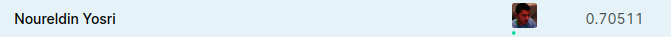
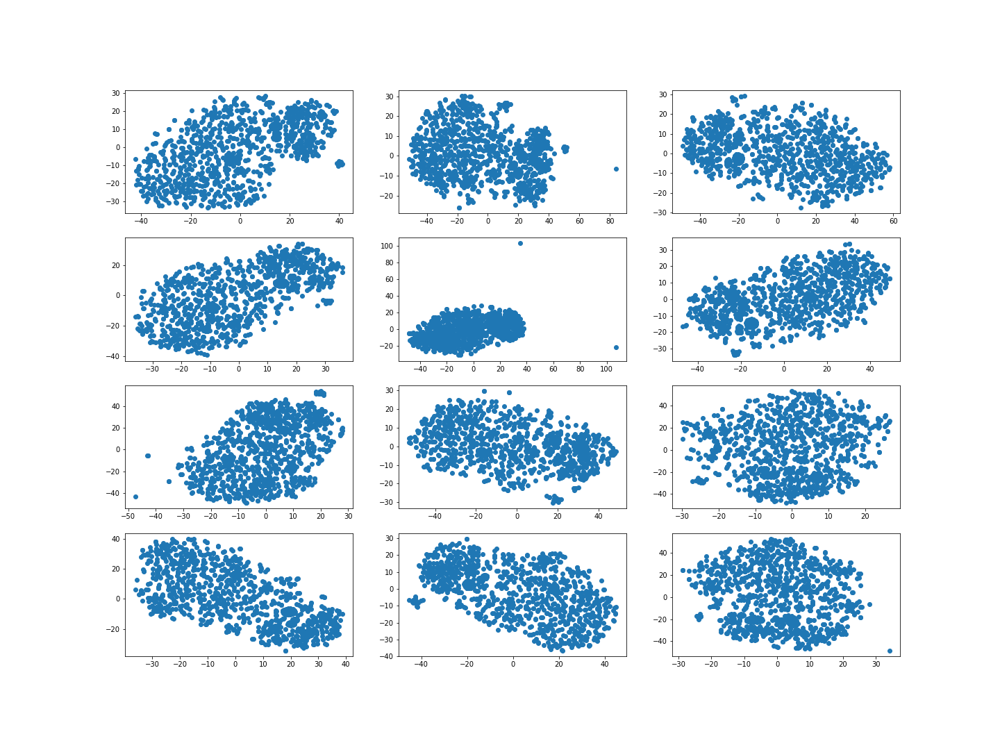

My work on the Arvato: Identify Customer Segments project
final score on kaggle leadership board is 0.70511 (best score is 0.80917)
the code assumes that the four .csv files dataset is located in ../data/ 
the work is split over the 5 notebooks as follows:
"1. EDA": exploratory data analysis, making sense of the data and determining what data transormation to do (e.g. columns to drop, how to fill NA, dealing with categorical variables)
"2. FeatureExtraction": using tSNE to do data visualization, examining the cross-correlation matrix and doing PCA
"3. prepare data": converting the data into numpy arrays ready for learning
"4. baseline model (xgb)": running the baseline model which is an xgb model which gets: 0.63847 on kaggle
"5. train model": create and train a vanilla neural network with up to 6 hidden layers, apply hyperparameter tuning -> 0.70511 score on kaggle

